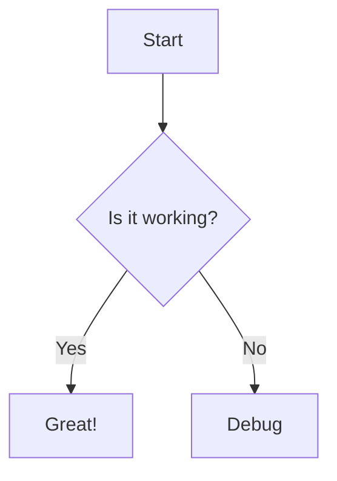

# 📓 CodeStudy Notes

A beautiful, Markdown-powered digital notebook designed specifically for developers and students. CodeStudy Notes features a premium split-pane interface, real-time live preview, and specialized features for studying computer science and programming.

## ✨ Features

- **Split-Pane Editor**: Write Markdown on the left, see a beautiful live preview on the right. Resize panels by dragging the divider.
- **Mac-Style Code Blocks**: Syntax highlighting for all major programming languages wrapped in a gorgeous macOS-style window frame with one-click copy buttons.
- **Advanced Markdown**: Full support for GitHub Flavored Markdown (GFM), including tables, strikethrough, and task lists.
- **PDF Export**: Generate perfectly formatted, textbook-quality PDF study guides from your notes with intelligent page-break handling.
- **Auto-Save**: Everything you write is automatically saved to your browser's local storage instantly.
- **Dark Mode**: Toggle between a beautiful, textbook-style light theme and a sleek dark theme.

## 🛠️ Specialized Syntax

CodeStudy Notes extends standard Markdown to support advanced study tools:

### Math Equations (KaTeX)
Write math inline using `$E = mc^2$` or as a block:
```markdown
$$
f(x) = \int_{-\infty}^\infty \hat f(\xi)\,e^{2 \pi i \xi x} \,d\xi
$$
```

### Mermaid Flowcharts
Create flowcharts directly in your notes by specifying `mermaid` as the code block language:
```markdown

```

### Text Highlighting
Use double equals signs to highlight important text:
```markdown
This is ==important information== that will be highlighted in yellow.
```

## ⌨️ Keyboard Shortcuts

CodeStudy Notes supports extensive keyboard shortcuts to speed up your workflow. Press `Ctrl + /` (or click the keyboard icon in the toolbar) to view the full list.

| Shortcut | Action |
|----------|--------|
| `Ctrl + B` | Bold |
| `Ctrl + I` | Italic |
| `Ctrl + K` | Insert Link |
| `Ctrl + \`` | Inline Code |
| `Ctrl + Z` | Undo |
| `Ctrl + Shift + Z` | Redo |
| `Tab` | Indent / Insert spaces |

## 💻 Tech Stack

- **Framework**: React 19 + Vite
- **Markdown Processing**: `react-markdown`, `remark-gfm`, `remark-math`, `rehype-katex`, `rehype-raw`
- **Diagrams**: Mermaid.js
- **Code Highlighting**: `react-syntax-highlighter` (Prism / Atom One Dark)
- **PDF Generation**: `html2pdf.js`
- **Code Quality**: ESLint (Flat Config) + Prettier

## 🚀 Getting Started

1. Clone the repository and install dependencies:
   ```bash
   npm install
   ```
2. Start the development server:
   ```bash
   npm run dev
   ```
3. Open `http://localhost:5173` in your browser.
